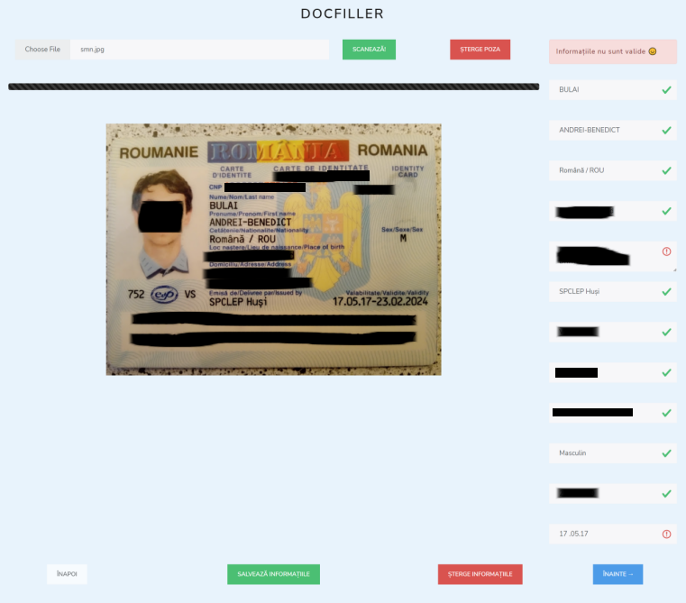
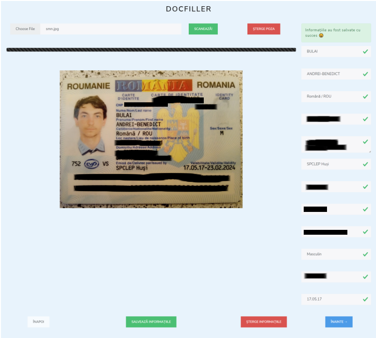

# DocFiller
Web application that fills your documents instantly. 
Document completion is an important task to legitimize the relationship between two parties. But it's usually a tedious and disliked process. That's why I created a simple app that fills the dread away.
DocFiller lets you add the informations for a person, either manually or by applying OCR on a romanian identity card, select the documents you want to fill out and download them instantly.

!Important! DocFiller is only a simulation app and includes only a selection of documents to be completed. It is not suited as a reliable way of actually filling the documents.

Home page

Choosing image and get data through OCR

Each field has rules, the validation failed in this case and user cannot go to the next step

Choosing desired documents

Download page
